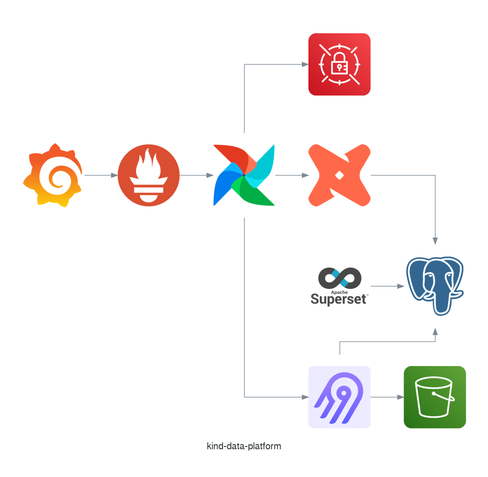

# kind-data-platform

[](https://github.com/feluelle/kind-data-platform/pulse)
[](https://results.pre-commit.ci/latest/github/feluelle/kind-data-platform/main)


[](https://www.apache.org/licenses/LICENSE-2.0.txt)
[](https://github.com/psf/black)

> A kind data platform on your local machine. 🤗

The objective of this project is to be able to quickly setup a data platform on your local machine via kind. It should also help you get familiar with production-ready setup and tools such as terraform, kubernetes and helm.

## 🏛️ Architecture

The following diagram shows the services currently being used, all running in a kind cluster:



## 🚀 Get started

### Prerequisites

Install the following tools:
- [awscli](https://aws.amazon.com/cli/)
- [docker](https://www.docker.com/)
- [kind](https://kind.sigs.k8s.io/)
- [kubectl](https://kubernetes.io/docs/tasks/tools/)
- [task](https://taskfile.dev/)
- [terraform](https://www.terraform.io/)

My docker setup i.e. `docker info`
```
...
CPUs: 10
Total Memory: 15.6GiB
...
```
If you give the docker daemon less resources, make sure to adjust the `timeout` parameter in the helm releases as creating them can take up more time.

### Setup

First create the main infrastructure by running the following command:
```bash
task -t infra/Taskfile.yml setup
```
Then create the localstack services, for this you first need to expose localstack first by running the following:
```bash
task -t infra/Taskfile.yml expose:localstack
```
and then create the services by running the following:
```bash
task -t infra/Taskfile.yml setup:localstack-services
```
_See [infra](infra/README.md) for more information about the projects infrastructure._

## 📜 Roadmap

You can find what is being worked on and what is to do in the [project](https://github.com/feluelle/kind-data-platform/projects/1).

## ❤️ Contributing

You're welcome to join this project and I would be more than happy to have you on board. Feel free to raise any issue you might encounter or open a PR to address it. Check out [CI](CI.md) to learn more about how we develop and test code.

If you want to jump right into it, here are..

[](https://github.com/feluelle/kind-data-platform/issues?q=is%3Aopen+is%3Aissue+label%3A"good+first+issue")

## 💬 Feedback

In case you like the project, just follow me..

[](https://github.com/feluelle)

In case you don't like the project or have any feedback for me drop me a mail at feluelle@pm.me.
