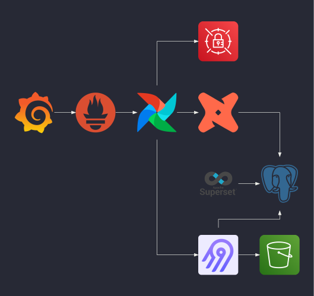

# kind-data-platform

> A kind data platform on your local machine. 🤗

The objective of this project is to be able to quickly setup a data platform on your local machine via kind. It should also help you get familiar with production-ready setup and tools such as terraform, kubernetes and helm.

## 🏛️ Architecture

The following diagram shows the services currently being used, all running in a kind cluster:



## 🚀 Get started

### Prerequisites

Install the following tools:
- [awscli](https://aws.amazon.com/cli/)
- [docker](https://www.docker.com/)
- [kind](https://kind.sigs.k8s.io/)
- [kubectl](https://kubernetes.io/docs/tasks/tools/)
- [task](https://taskfile.dev/)
- [terraform](https://www.terraform.io/)

My docker setup i.e. `docker info`
```
...
CPUs: 10
Total Memory: 15.6GiB
...
```
If you give the docker daemon less resources, make sure to adjust the `timeout` parameter in the helm releases as creating them can take up more time.

### Setup

First create the main infrastructure by running the following command:
```bash
task -t infra/Taskfile.yml setup:cluster
```
Then create the localstack resources, for this you first need to expose the localstack service first by running the following:
```bash
task -t infra/Taskfile.yml expose:localstack
```
and then create the resources by running the following:
```bash
task -t infra/Taskfile.yml setup:localstack-resources
```
_See [infra](infra/README.md) for more information about the projects infrastructure._

## 📜 Roadmap

You can find what is being worked on and what is to do in the [project](https://github.com/feluelle/kind-data-platform/projects/1).
