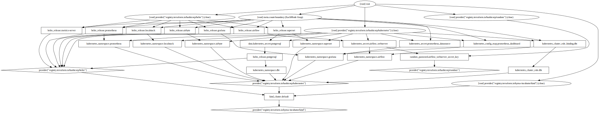

# infra

This folder contains all the infrastructure needed for setting up the data platform.



## airbyte

I am using [Airbyte](https://airbyte.io) to **extract and load** data to the postgres database.

## airflow

I am using [Airflow](https://airflow.apache.org) to **orchestrate** ETL jobs.

### Notes

Airflow requires a [Webserver Secret Key](https://airflow.apache.org/docs/helm-chart/stable/production-guide.html#webserver-secret-key) to function properly.

You can run the following command to create one:
```bash
python3 -c 'import secrets; print(secrets.token_hex(16))'
```
Then put this key into a `.auto.tfvars` file like so:
```terraform
airflow_webserver_secret_key = "<put-your-key-here>"
```

## dbt

I am using [dbt](https://www.getdbt.com) to transform data within the postgres database.

### Notes

To retrieve the password for the postgresql user `postgres`, run the following:
```bash
kubectl get secret --namespace dbt postgresql -o jsonpath="{.data.postgresql-password}" | base64 --decode ; echo
```

I initially created the dbt repo via the following command
```bash
docker run --rm -v (pwd)/dbt:/opt/dbt -w /opt/dbt fishtownanalytics/dbt:0.21.0 init project
```

## prometheus

I am using [Prometheus](https://prometheus.io) to scrape **metrics** of all services.

## grafana

I am using [Grafana](https://grafana.com) to **monitor** all services.

### Notes

To retrieve the password for the grafana user `admin`, run the following:
```bash
kubectl get secret --namespace grafana grafana -o jsonpath="{.data.admin-password}" | base64 --decode ; echo
```

## superset

I am using [Superset](https://superset.apache.org) to **visualise** data.
