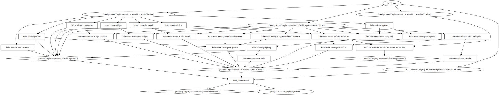

# infra

This folder contains all the infrastructure needed for setting up the data platform.



## airbyte

I am using [Airbyte](https://airbyte.io) to **extract and load** data to the postgres database.

## airflow

I am using [Airflow](https://airflow.apache.org) to **orchestrate** ETL jobs.

## dbt

I am using [dbt](https://www.getdbt.com) to transform data within the postgres database.

### Notes

To retrieve the password for the postgresql user `postgres`, run the following:
```bash
kubectl get secret --namespace dbt postgresql -o jsonpath="{.data.postgresql-password}" | base64 --decode ; echo
```

## grafana

I am using [Grafana](https://grafana.com) to **monitor** all services.

### Notes

To retrieve the password for the grafana user `admin`, run the following:
```bash
kubectl get secret --namespace grafana grafana -o jsonpath="{.data.admin-password}" | base64 --decode ; echo
```

## localstack

I am using [localstack](https://localstack.cloud) to create a local stack of AWS resoures to store **secrets and data**.

### Notes

To create the localstack resources you need to expose the localstack service first by running the following:
```bash
task -t infra/Taskfile.yml expose:localstack
```
and then create the resources by running the following:
```bash
task -t infra/Taskfile.yml setup:localstack-resources
```

## prometheus

I am using [Prometheus](https://prometheus.io) to scrape **metrics** of all services.

## superset

I am using [Superset](https://superset.apache.org) to **visualise** data.
